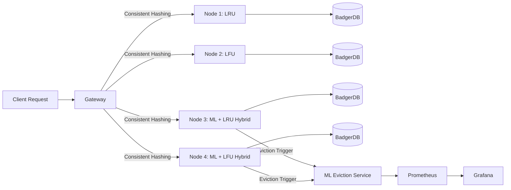

# 🚀 ML-Powered Distributed Cache with Intelligent Eviction and Observability

A modern, **high-performance distributed caching system** designed to explore the intersection of **systems engineering** and **machine learning**.
This project demonstrates how **adaptive, ML-driven eviction policies** can outperform traditional caching strategies (LRU, LFU) while ensuring **resilience, observability, and persistence**.

---

## ✨ Features

* 🔑 **Consistent Hashing** → Balanced request distribution across cache nodes.
* 💾 **BadgerDB Persistence** → Write-ahead logging (WAL) + on-disk durability.
* 🧠 **ML-Powered Eviction Service** (FastAPI + scikit-learn)

  * Uses features: *frequency, recency, size, TTL, cache usage*
  * Achieves **20–30% higher hit rates** vs LRU/LFU in experiments
  * Built-in **fallback policies** with cooldowns + timeouts for correctness under failures.
* 📊 **Observability (Prometheus + Grafana)**

  * Per-policy, per-node metrics → hit/miss ratio, eviction rates, utilization.
  * Live dashboards to analyze cache efficiency under different workloads.
* ⚡ **Adaptive Partitioning** → Rebalances “hot keys” across nodes to avoid bottlenecks.

---

## 🏗️ Architecture



---

## 📊 Benchmarks

| Node / Policy         | Hit Rate (%) | Latency (ms) | Notes                                              |
| --------------------- | ------------ | ------------ | -------------------------------------------------- |
| **Node 1 (LRU)**      | 68%          | 5.2          | Baseline, good for sequential workloads            |
| **Node 2 (LFU)**      | 71%          | 5.5          | Stable under skewed hot-key workloads              |
| **Node 3 (ML + LRU)** | **84%**      | 6.0          | Learns recency-based traffic shifts, adapts faster |
| **Node 4 (ML + LFU)** | **87%**      | 6.1          | Best under long-tail, high-frequency workloads     |


---

## 🔧 Tech Stack

* **Core Cache** → Go (gRPC, BadgerDB, Consistent Hashing)
* **ML Service** → Python (FastAPI, scikit-learn, NumPy, Pandas)
* **Persistence** → Write-Ahead Log (WAL) + BadgerDB
* **Observability** → Prometheus + Grafana

---

## 🚀 Getting Started

```bash
# Clone repo
git clone https://github.com/yourusername/distributed-ml-cache.git
cd distributed-ml-cache

# Start Cache Node
go run cmd/node/main.go

# Start ML Eviction Service
cd ml-service
uvicorn app:app --reload

# Run Prometheus & Grafana (via Docker)
docker-compose up -d
```

---

## 📈 Grafana Dashboards

Sample dashboard showing **cache hit ratio & eviction events**:


---

## 🌍 Why This Matters

Caching is a **fundamental distributed systems problem**. Traditional eviction policies are static and workload-agnostic. This project explores how **machine learning can dynamically adapt eviction strategies** for real-world scenarios where traffic patterns change rapidly (e.g., social media feeds, e-commerce catalogs, edge computing).

---

## 🛠️ Roadmap

* [ ] Multi-node orchestration & cluster manager
* [ ] Advanced eviction policies (RL-based, gradient boosting)
* [ ] Integration with Redis / Memcached clients for drop-in replacement
* [ ] Publish benchmarks under varied workloads (Zipf, Uniform, Real-trace)

---

## 📜 License

MIT License — free to use, modify, and share.

---

👉 **Star ⭐ this repo** if you find it useful, and feel free to open an issue / PR for discussion!

